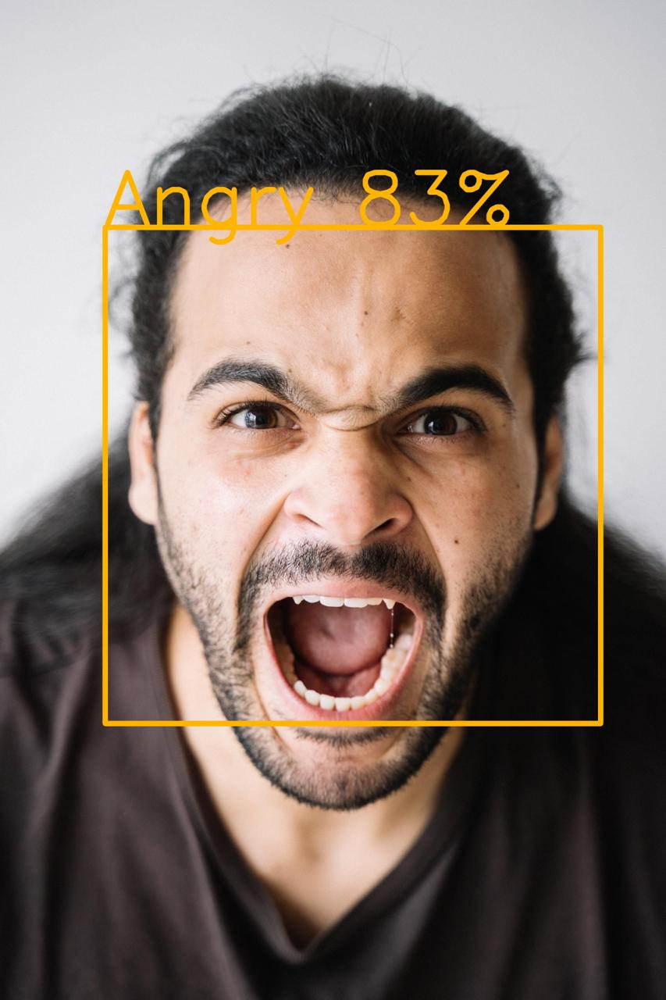
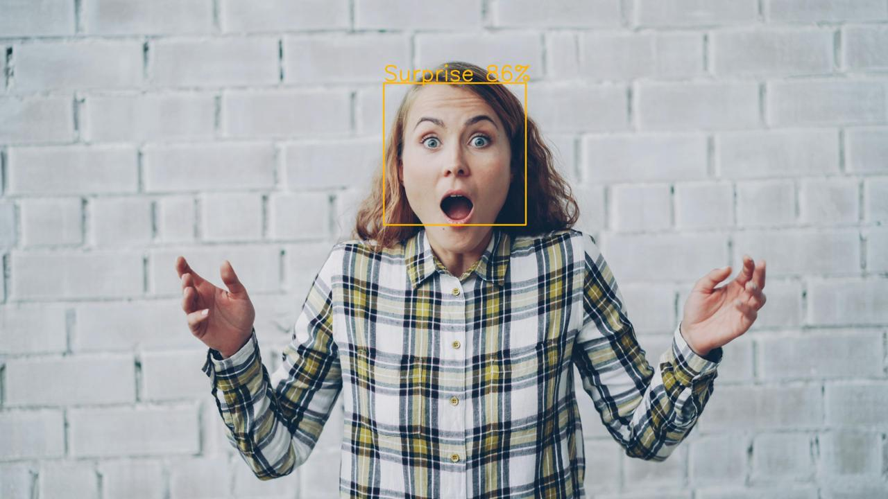
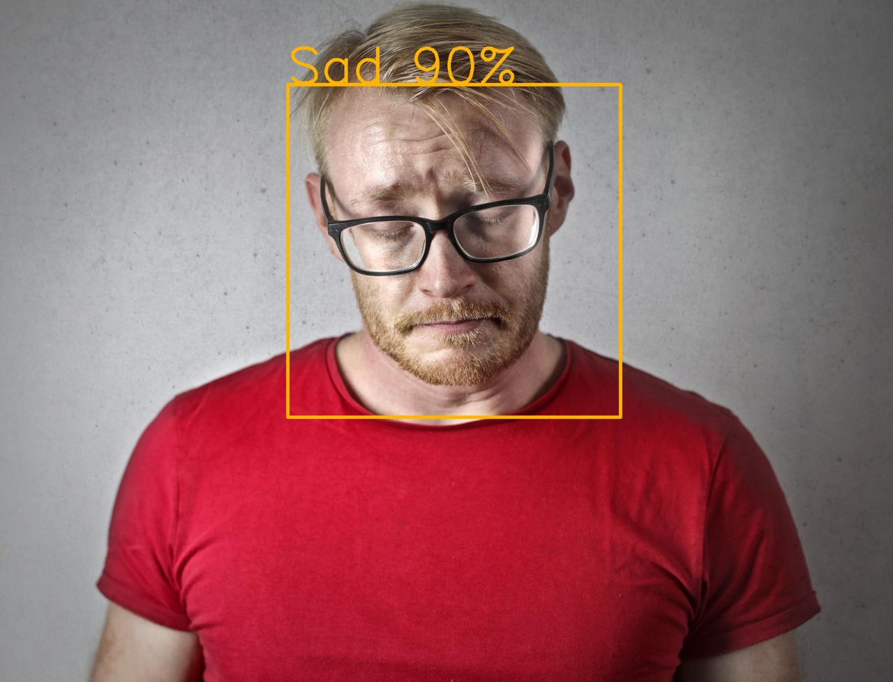
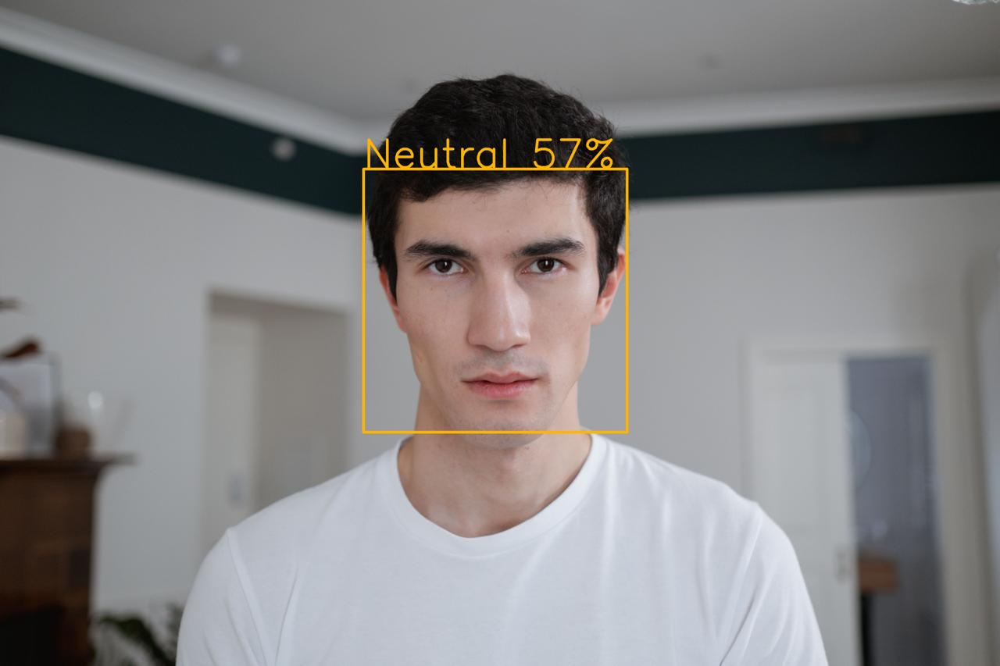
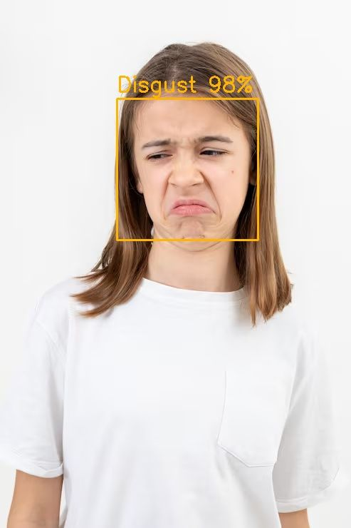
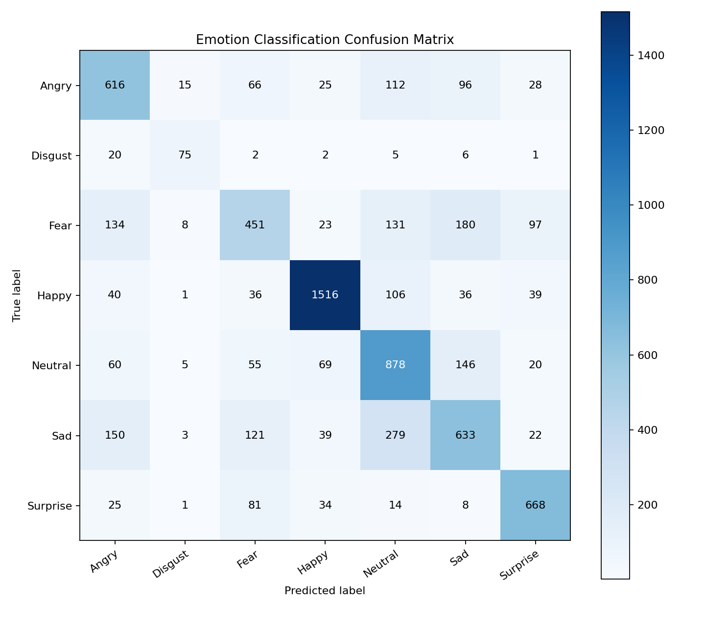

# Face Emotion Detection

Real-time facial emotion recognition built with TensorFlow and OpenCV. The system detects a face from a webcam feed, preprocesses the face region, predicts one of seven emotions, and displays the result live with confidence smoothing.


## Demo

| Angry | Happy | Surprise |
|---|---|---|
|  |  |  |

| Sad | Neutral | Disgust |
|---|---|---|
|  |  |  |

## Highlights

- Real-time webcam emotion detection using OpenCV.
- Seven emotion classes: Angry, Disgust, Fear, Happy, Neutral, Sad, and Surprise.
- FER2013-friendly grayscale CNN trained on 48x48 facial expression images.
- Data augmentation and class weighting to reduce dataset imbalance.
- Evaluation pipeline with precision, recall, F1-score, and confusion matrix.
- Compatibility loader for Colab-trained Keras models used locally in VS Code.

## Results

Evaluation on the test split:

| Metric | Score |
|---|---:|
| Accuracy | 67.39% |
| Macro F1-score | 66.00% |
| Weighted F1-score | 67.15% |

Per-class F1-score:

| Emotion | F1-score |
|---|---:|
| Happy | 87.08% |
| Surprise | 78.31% |
| Disgust | 68.49% |
| Neutral | 63.67% |
| Angry | 61.51% |
| Sad | 53.83% |
| Fear | 49.13% |



The model performs best on visually clearer expressions such as Happy and Surprise. Fear and Sad are more difficult because FER2013-style images are low-resolution and some facial expressions overlap visually.

## Project Structure

```text
face_emotion_detection/
  config.py                  # Shared paths and training constants
  emotion_utils.py           # Model loading and face preprocessing helpers
  train_model.py             # CNN training pipeline
  evaluate_model.py          # Classification report and confusion matrix
  predict_image.py           # Single-image prediction
  realtime_detection.py      # Webcam-based live emotion detection
  train_colab.ipynb          # Colab training workflow
  haarcascade_frontalface_default.xml
  model/
    emotion_model.h5
    emotion_labels.json
    class_indices.json
  docs/
    angry.jpg
    happy.jpg
    surprise.jpg
    sad.jpg
    neutral.jpg
    disgust.jpg
    confusion_matrix.png
```

## Setup

Clone the repository and install the dependencies:

```bash
git clone https://github.com/ashmit-rana/Face-Emotion-Detection.git
cd Face-Emotion-Detection

python3 -m venv .venv
source .venv/bin/activate
pip install -r requirements.txt
```

## Run Real-Time Detection

```bash
python3 realtime_detection.py
```

Press `q` to close the webcam window.

Useful options:

```bash
python3 realtime_detection.py --smooth-frames 15 --confidence-threshold 0.40
```

## Predict a Single Image

```bash
python3 predict_image.py path/to/image.jpg --save-annotated output.jpg
```

## Evaluate the Model

```bash
python3 evaluate_model.py
```

This creates:

```text
reports/classification_report.txt
reports/confusion_matrix.png
```

## Train the Model

The default training pipeline uses a CNN designed for FER2013-style grayscale images:

```bash
python3 train_model.py --epochs 80 --batch-size 64
```

The training script includes:

- image augmentation
- square-root class weighting
- label smoothing
- dropout and L2 regularization
- early stopping
- learning-rate reduction
- best-model checkpointing

For longer training runs, Google Colab with a T4 GPU is recommended. The included `train_colab.ipynb` notebook can be used for that workflow.

## Dataset

This project uses a FER2013-style dataset organized into seven emotion folders. The dataset is not included in this repository because image datasets can be large and may have licensing or privacy restrictions.

Expected structure:

```text
dataset/
  train/
    angry/
    disgust/
    fear/
    happy/
    neutral/
    sad/
    surprise/
  test/
    angry/
    disgust/
    fear/
    happy/
    neutral/
    sad/
    surprise/
```

## Notes

The included model is trained for demonstration and learning purposes. Facial emotion recognition is sensitive to lighting, face crop quality, dataset bias, and expression ambiguity, so real-world predictions may vary.

Future improvements could include a stronger face detector, face alignment, FERPlus or RAF-DB training data, and more advanced architectures.
